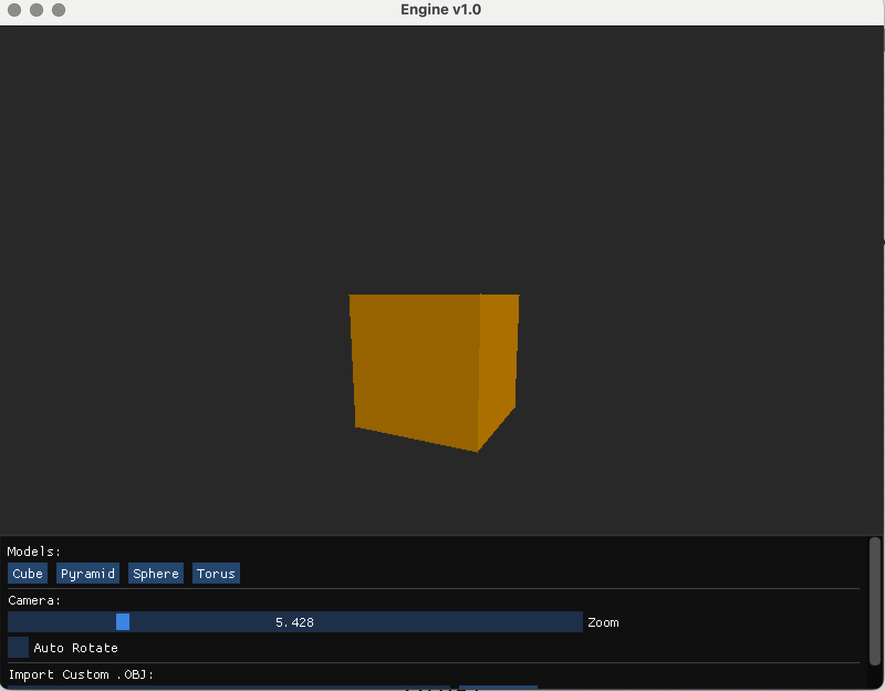
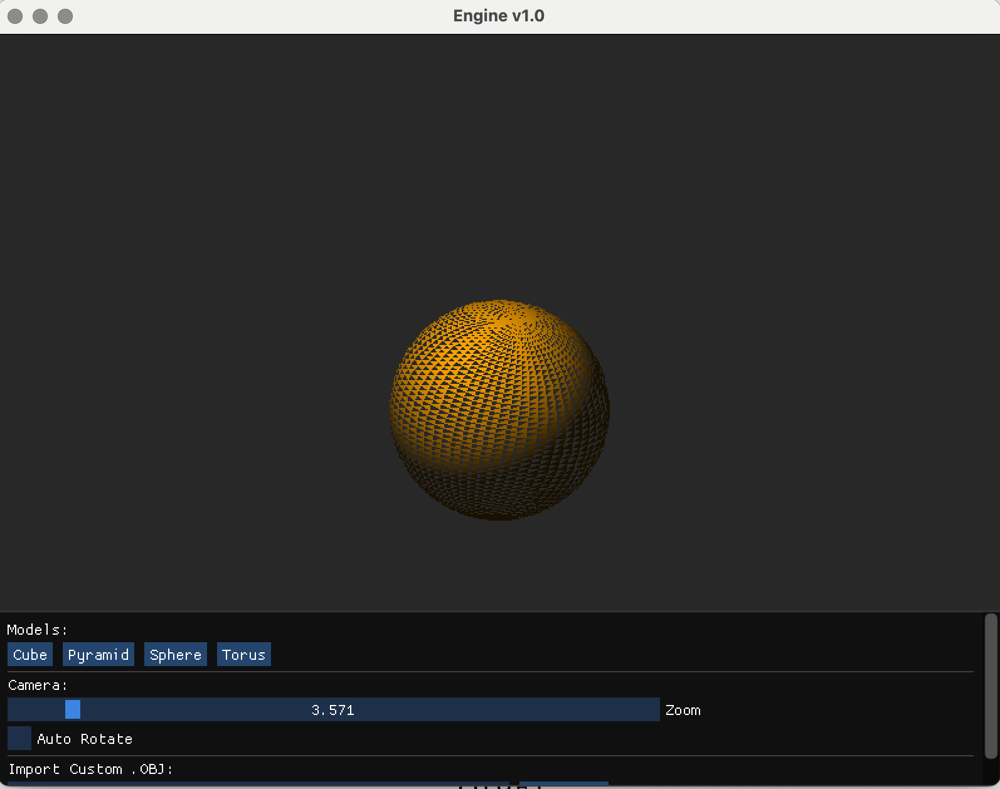
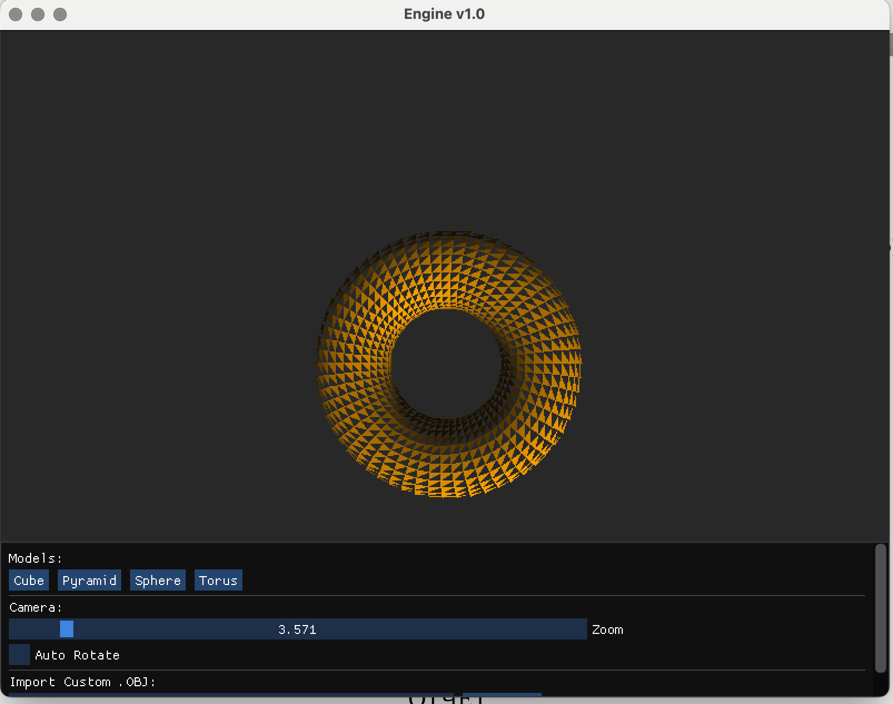

# Графический движок на C++

Этот проект представляет собой **программный графический движок (Software Renderer)**, написанный на C++ с минимальным использованием сторонних библиотек.

**Главная цель проекта:** Реализовать весь графический конвейер (Pipeline) "вручную" на CPU, чтобы глубоко понять принципы работы компьютерной графики. OpenGL используется исключительно как "холст" для вывода готового массива пикселей на экран, вся математика и алгоритмы растеризации реализованы с нуля.

## 🎯 Особенности

- **Полный цикл рендеринга на CPU**: Вершинные трансформации, отсечение граней, растеризация, освещение.
    
- **Собственный математический аппарат**: Векторы, матрицы, проекции, трансформации (без использования GLM).
    
- **Загрузка 3D моделей**: Парсер формата `.obj`.
    
- **Интерактивность**: Управление вращением (мышь), зумом и сменой моделей через GUI (ImGui).
    
- **Кроссплатформенная сборка**: CMake (macOS/Linux/Windows).
    

---

## 🛠 Архитектура и Модули

Проект разделен на логические модули, каждый из которых решает свою задачу в графическом конвейере.

## 1. Математическое ядро (`math_3d`)

Собственная реализация линейной алгебры, необходимой для 3D-графики:

- **Векторы (`Vec3`)**: Сложение, вычитание, нормализация, скалярное (`Dot`) и векторное (`Cross`) произведения.
    
- **Матрицы (`Mat4`)**: Матрицы 4x4 для трансформаций. Реализованы методы:
    
    - `Identity` (Единичная матрица).
        
    - `RotateX`, `RotateY`, `RotateZ` (Матрицы вращения).
        
    - `Translate` (Матрица сдвига).
        
    - `Projection` (Матрица перспективной проекции).
        
- **Трансформация**: Функция `MultiplyMatrixVector` для умножения вектора на матрицу с учетом перспективного деления (Perspective Divide).
    

## 2. Главный алгоритм (Конвейер)

Реализован в `main.cpp` и связывает все компоненты воедино:

1. **Update**: Обработка ввода (ImGui, мышь), обновление матриц вращения и камеры.
    
2. **Vertex Processing**: Трансформация вершин из локальных координат в мировые (`World Space`).
    
3. **Geometry Processing**:
    
    - Расчет нормалей граней.
        
    - **Backface Culling**: Отсечение невидимых граней на основе скалярного произведения нормали и вектора взгляда.
        
    - **Lighting**: Расчет освещения по модели Ламберта (Diffuse).
        
4. **Projection**: Перевод в клип-пространство и деление на `w` (получение NDC координат).
    
5. **Viewport Transform**: Перевод нормализованных координат в пиксельные координаты экрана.
    
6. **Rasterization**: Вызов отрисовки треугольника.
    

## 3. Загрузчик моделей (`mesh`)

Простой и эффективный парсер формата **Wavefront .OBJ**:

- Читает вершины (`v`).
    
- Читает грани (`f`).
    
- Поддерживает базовую геометрию для загрузки кубов, сфер, торов и пирамид.
    
- Автоматически копирует загружаемые файлы в папку `assets/`.
    

## 4. Рендерер (`renderer`)

Низкоуровневый модуль отрисовки, имитирующий работу видеокарты:

- **FrameBuffer**: Использует `std::vector<uint32_t>` как буфер цвета. Все рисование происходит в этот массив в оперативной памяти.
    
- **Алгоритмы рисования**:
    
    - `PutPixel`: Установка цвета конкретного пикселя.
        
    - `DrawLine`: Алгоритм **Брезенхема** для рисования линий (Wireframe).
        
    - `DrawTriangle`: Алгоритм растеризации треугольника через **Edge Functions** (барицентрические координаты). Попиксельная проверка принадлежности точки треугольнику.
        
- **Вывод на экран**: Использует OpenGL текстуру (`glTexSubImage2D`) для отображения содержимого буфера на два треугольника, растянутых на весь экран.
    

---

## 🚀 Сборка и Запуск

Для сборки требуется **CMake**, компилятор C++ (Clang/GCC/MSVC) и установленные зависимости (включены в репозиторий)


```
# 1. Клонирование репозитория git clone https://github.com/your-username/your-repo.git cd your-repo
# 2. Создание папки сборки mkdir build cd build
# 3. Конфигурация и сборка
cmake ..
make
# 4. Запуск ./app
```

## 🎮 Управление

- **Левая кнопка мыши**: Вращение модели (если отключен "Auto Rotate").
    
- **Панель управления (внизу)**:
    
    - Кнопки выбора моделей (Cube, Pyramid, Sphere, Torus).
        
    - Слайдер **Zoom**: Приближение/удаление камеры.
        
    - Поле **Import**: Загрузка произвольного `.obj` файла.
        

---

## Демонстрация проекта







Немного не доработан рендеринг тора и сферы, это можно внести в планы по улучшению проекта во 2ом семестре.

------

_Проект создан в образовательных целях для демонстрации работы графического конвейера без использования аппаратного ускорения для расчетов геометрии._
